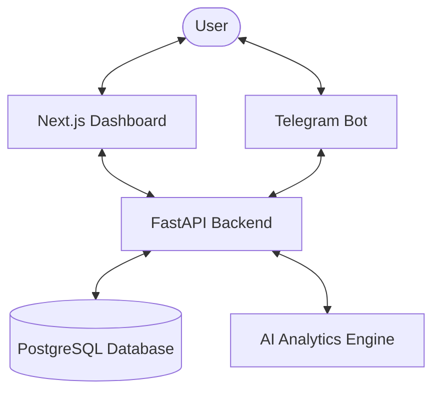

# 🛡️ QA Defect Analytics & AI Platform

[](https://nextjs.org/)
[](https://fastapi.tiangolo.com/)
[](https://openai.com/)
[](https://tailwindcss.com/)

A professional-grade platform designed for managing QA defect workflows, AI-powered analytics, and integrated Telegram bot services for real-time notifications and onboarding.

---

## 🌟 Key Features

*   **📊 Comprehensive Dashboard**: Real-time analytics of QA defects, statuses, and performance metrics.
*   **🤖 AI-Powered Insights**: Automated analysis and classification of defects using modern AI models.
*   **🏢 Workflow Management**: A rigorous "Submit → Review → Authorize" lifecycle for applications.
*   **📱 Telegram Integration**: A dedicated Telegram bot for seamless onboarding, account linking, and instant updates.
*   **🔐 Secure Authentication**: Robust user management and role-based access control (RBAC).

---

## 🏗️ Project Architecture



---

## 🛠️ Tech Stack

### Frontend
- **Framework**: [Next.js](https://nextjs.org/) (App Router)
- **UI Components**: [Shadcn/UI](https://ui.shadcn.com/), [Radix UI](https://www.radix-ui.com/)
- **Icons**: [Lucide React](https://lucide.dev/)
- **Charts**: [Recharts](https://recharts.org/)
- **Styling**: [Tailwind CSS](https://tailwindcss.com/)

### Backend
- **Framework**: [FastAPI](https://fastapi.tiangolo.com/)
- **Database**: [PostgreSQL](https://www.postgresql.org/) with [Alembic](https://alembic.sqlalchemy.org/) migrations
- **Asynchronous Processing**: [Uvicorn](https://www.uvicorn.org/)
- **Bot Engine**: Telegram Bot API integration

---

## 🚀 Getting Started

### Prerequisites

- [Node.js](https://nodejs.org/) (v18+)
- [Python](https://www.python.org/) (v3.10+)
- [Git](https://git-scm.com/)

### Installation & Setup

#### 1. Clone the repository
```bash
git clone https://github.com/your-repo/qa-project.git
cd QA-project
```

#### 2. Running the Frontend
Open a terminal and navigate to the frontend directory:
```bash
cd frontend
npm install
npm run dev
```
The dashboard will be available at [http://localhost:3000](http://localhost:3000).

#### 3. Running the Backend
Open **another terminal** and navigate to the backend directory:
```bash
cd backend
pip install -r requirements.txt
python -c "import uvicorn; uvicorn.run('app.main:app', host='0.0.0.0', port=8000, reload=True)"
```
The API documentation will be available at [http://localhost:8000/docs](http://localhost:8000/docs).

---

## 📂 Project Structure

```text
QA-project/
├── backend/            # FastAPI Backend API
│   ├── app/            # Main application logic
│   ├── alembic/        # Database migrations
│   └── reports/        # Generated reports
├── frontend/           # Next.js Dashboard
│   ├── app/            # App router pages
│   ├── components/     # UI components
│   └── styles/         # Global styles
└── README.md           # Project documentation
```

---

## 🛡️ License

Distributed under the MIT License. See `LICENSE` for more information.

---

## 🤝 Contributing

1. Fork the Project
2. Create your Feature Branch (`git checkout -b feature/AmazingFeature`)
3. Commit your Changes (`git commit -m 'Add some AmazingFeature'`)
4. Push to the Branch (`git push origin feature/AmazingFeature`)
5. Open a Pull Request
